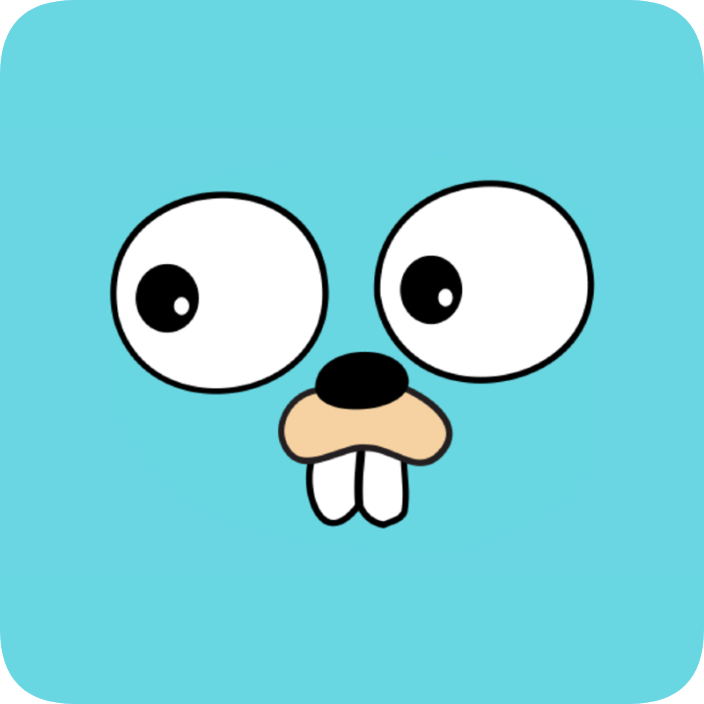
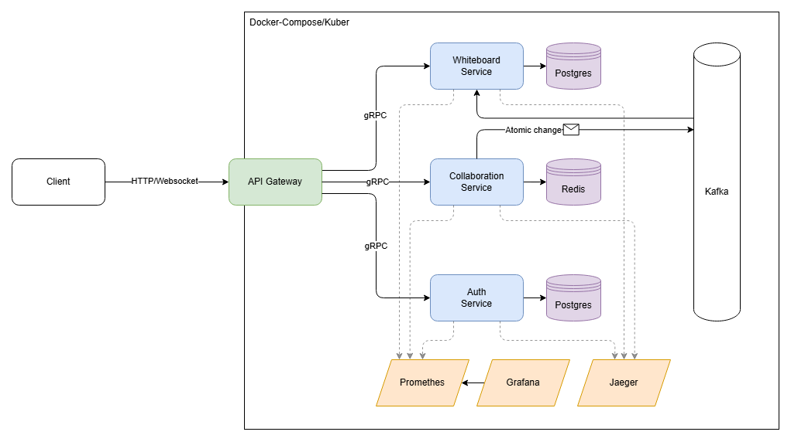

[//]: # (Project logo)
 

    
    <h3 align="center">Go-Whiteboard</h3>

## 📌 About project

[Go-Whiteboard](https://github.com/S1riyS/go-whiteboard) is a service for creating and editing collaborative whiteboards in real time!

## 🗺️ Structure

## 🛠️ Technology Stack
- [Go](https://go.dev/) - Language
    - [Gin](https://gin-gonic.com/) - Web framework
    - [log/slog](https://pkg.go.dev/log/slog) - Logging
- Communication:
    - [gRPC](https://grpc.io/) - Interservice communication
- Persistence:
    - [Postgres](https://www.postgresql.org/) - SQL Database
- Tools:
    - [Taskfile](https://taskfile.dev/) - Task runner / Build tool
    - [Air](https://github.com/cosmtrek/air) - Live reload

*As the project will evolve, this list will be updated*

<a href="#readme-top">⬆️ Back To Top</a>
